# Manual do Sistema NAVE

Oi! Este manual é para você que vai usar o sistema no dia a dia da NAVE.

Não é preciso saber nada de computador além de usar um navegador. Cada tarefa
está explicada do começo ao fim, na ordem em que as coisas acontecem aqui:
a beneficiária chega, você cadastra, faz a triagem, encaminha para a
especialidade certa e marca o atendimento.

Se você já conhece o sistema e só quer relembrar uma coisa específica, pule
direto para a tarefa que precisa. Se for a sua primeira vez, vale ler na ordem.

---

## Índice

1. [O que cada perfil pode fazer](#1-o-que-cada-perfil-pode-fazer)
2. [Entrar no sistema](#2-entrar-no-sistema)
3. [Cadastrar uma beneficiária](#3-cadastrar-uma-beneficiária)
4. [Fazer uma triagem](#4-fazer-uma-triagem)
5. [Encaminhar para uma especialidade](#5-encaminhar-para-uma-especialidade)
6. [Agendar o atendimento](#6-agendar-o-atendimento)
7. [Arquivar uma beneficiária](#7-arquivar-uma-beneficiária)
8. [Problemas comuns](#8-problemas-comuns)

---

## 1. O que cada perfil pode fazer

Quando a sua conta foi criada, ela recebeu um ou mais perfis. O perfil decide
o que aparece no menu da esquerda e o que você consegue abrir.

Se você não enxerga alguma coisa que este manual menciona, provavelmente é
porque aquela parte não faz parte do seu perfil — não é erro do sistema, e não
é nada que você tenha feito de errado.

### Gestora

Enxerga e faz tudo. É o perfil de quem coordena.

- Cadastrar, editar e arquivar beneficiárias
- Fazer triagens e encaminhamentos
- Ver e organizar a agenda de toda a equipe
- Abrir prontuários
- Cadastrar e editar as pessoas da equipe
- Registrar doações, doadores, campanhas e bazares

### Triadora

É quem acolhe e faz a primeira escuta.

- Fazer triagens e registrar as queixas
- Encaminhar para as especialidades
- Ver e organizar a agenda
- Cadastrar uma beneficiária nova **durante a triagem** (explico como na
  seção 4)

**Não abre prontuários.** Isso é proposital: o prontuário guarda o que foi
conversado no atendimento clínico, e o acesso fica com quem atende. Se você
tentar entrar, o sistema devolve para a tela inicial.

O menu "Beneficiárias" também não aparece para a triadora — mas você não fica
sem saída: dá para cadastrar a beneficiária dentro da própria triagem.

### Profissional

É quem atende: psicologia, assistência social, fisioterapia, acupuntura, FEPAD.

- Ver a sua agenda de atendimentos
- Confirmar, marcar como realizado ou cancelar os **seus** atendimentos
- Preencher e consultar prontuários
- Gerar o PDF da ficha

Você só edita os atendimentos que são seus. Os das colegas aparecem, mas não
podem ser alterados por você.

> Uma pessoa pode ter mais de um perfil. Se a sua conta é triadora **e**
> profissional, você enxerga a soma das duas coisas.

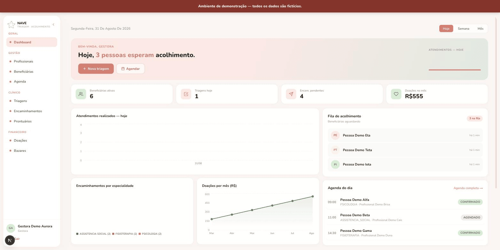

---

## 2. Entrar no sistema

1. Abra o navegador e digite o endereço do sistema.
2. Preencha o **e-mail** e a **senha** que a coordenação te passou.
3. Clique em **Entrar**.

Deu certo? Você cai direto na tela inicial, com o resumo do seu dia.

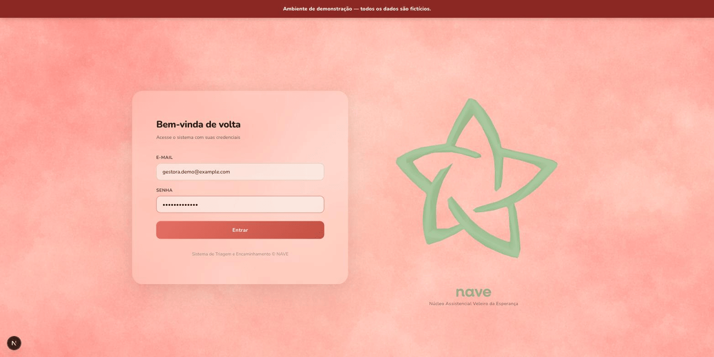

### Se aparecer uma mensagem em vermelho

O sistema avisa o que aconteceu, em português:

| Mensagem | O que fazer |
|----------|-------------|
| "E-mail ou senha incorretos" | Confira se o e-mail está completo e se o Caps Lock não está ligado. |
| "A senha deve ter pelo menos 6 caracteres" | A senha está incompleta — digite de novo. |
| "Seu acesso está desativado" | Sua conta foi desativada. Fale com a coordenação. |
| "Não foi possível conectar ao servidor" | Veja a [seção 8](#8-problemas-comuns). |

### Sair do sistema

No rodapé do menu da esquerda, embaixo do seu nome, tem o botão **Sair**.

Use sempre que for embora, principalmente se o computador for compartilhado.
O sistema tem dados de beneficiárias, e a tela aberta é a mesma coisa que a
pasta aberta em cima da mesa.

### O sistema me pediu login de novo, do nada

É normal. Depois de cerca de 8 horas, o sistema pede que você entre outra vez,
por segurança. Nada que você salvou se perde — é só entrar de novo.

---

## 3. Cadastrar uma beneficiária

> Este é o caminho para **gestoras**. Se você é triadora, o cadastro acontece
> dentro da triagem — pule para a [seção 4](#4-fazer-uma-triagem).

1. No menu da esquerda, clique em **Beneficiárias**.
2. No canto superior direito, clique em **Nova Beneficiária**.

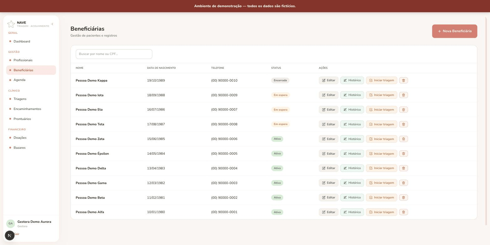

3. Preencha a ficha.

**Só o nome completo é obrigatório.** Todo o resto pode ficar em branco e ser
completado depois. Isso é de propósito: no acolhimento nem sempre dá para
perguntar tudo, e é melhor registrar a pessoa com o que você tem do que deixar
para depois.

Os campos disponíveis:

| Campo | Observação |
|-------|------------|
| **Nome completo** | O único obrigatório. |
| CPF | Pode deixar em branco. Se preencher, não pode repetir o de outra beneficiária já cadastrada. |
| Data de nascimento | |
| Telefone | |
| Endereço | |
| Tipo | Adulta, Adolescente ou Criança. Começa como Adulta. |
| Responsável (mãe) | Aparece quando o tipo é Criança ou Adolescente. Busque pelo nome da adulta já cadastrada. |
| Estado civil, Escolaridade, Raça/Cor, Ocupação, Situação de emprego | Dados socioeconômicos, todos opcionais. |
| Status | Ativa, Em espera, Encerrada ou Desistente. Começa como Ativa. |

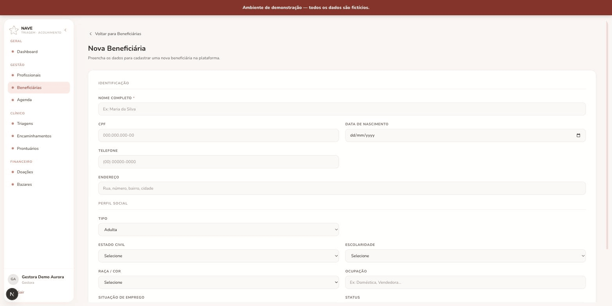

4. Clique em **Salvar**.

### Sobre o campo Status

É ele que diz em que ponto a beneficiária está:

- **Ativa** — está sendo acompanhada.
- **Em espera** — passou pelo acolhimento e aguarda vaga. Aparece na fila de
  espera da tela inicial.
- **Encerrada** — o acompanhamento terminou.
- **Desistente** — parou de vir.

### Ligar uma criança à mãe

Quando o tipo for **Criança** ou **Adolescente**, aparece o campo
**Responsável**. Comece a digitar o nome da mãe (ou da responsável adulta) e
selecione na lista que aparece.

Vale cadastrar a adulta primeiro. Assim ela já existe para ser encontrada na
busca.

### Depois de cadastrar

Na lista de beneficiárias, cada linha tem botões de ação à direita:

- **Editar** — corrigir ou completar a ficha
- **Histórico** — ver as triagens e os prontuários daquela pessoa
- **Nova triagem** — já começa a triagem com ela selecionada
- **Arquivar** — [seção 7](#7-arquivar-uma-beneficiária)

---

## 4. Fazer uma triagem

A triagem tem **duas etapas**, e o sistema mostra em qual você está no alto da
tela. Nada é salvo até você confirmar no final — pode ir e voltar à vontade.

Para começar: menu **Triagens** → botão **Nova triagem**.

### Etapa 1 — Dados da beneficiária

Primeiro o sistema pergunta de quem é essa triagem. Você escolhe entre duas
opções, clicando na que quiser:

**"Beneficiária já cadastrada"** — para quem já está no sistema.
Digite o nome no campo de busca e clique na pessoa certa na lista que aparece.

**"Nova beneficiária"** — para quem está chegando agora.
Abre a ficha completa ali mesmo, sem precisar sair da triagem. É o caminho da
triadora. Os campos são os mesmos da [seção 3](#3-cadastrar-uma-beneficiária),
e de novo: **só o nome completo é obrigatório**.

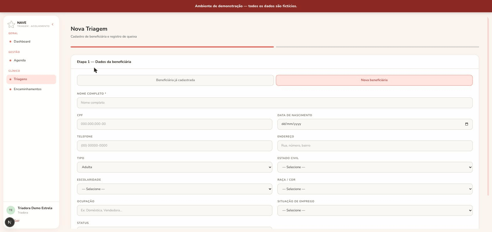

Quando terminar, clique em **Próximo →**.

> Se aparecer "Selecione uma beneficiária cadastrada" ou "Nome completo é
> obrigatório", é só isso mesmo: falta escolher a pessoa ou escrever o nome.
> Complete e clique em Próximo de novo.

### Etapa 2 — Registro da queixa

Aqui você registra o que a beneficiária trouxe.

| Campo | O que escrever |
|-------|----------------|
| **Queixa principal** | Obrigatório. O motivo principal da procura, com as palavras dela sempre que possível. |
| Queixa secundária | Outra questão que apareceu junto. |
| Sintomas | O que ela relata sentir. |
| Tipo de violência | Se houver. Ex.: física, psicológica, sexual, negligência. |
| Observações | O que mais for importante para quem for atender. |

Escreva com calma. É esse texto que a profissional vai ler antes do primeiro
atendimento — quanto mais claro, melhor o acolhimento do outro lado.

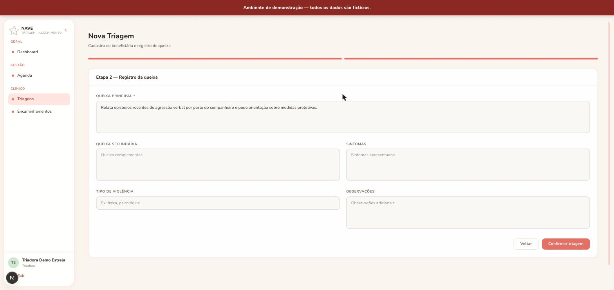

Para terminar, clique em **Confirmar triagem**.

Se precisar corrigir alguma coisa da ficha, clique em **Voltar** — o que você
já escreveu na queixa continua lá.

Salvou? O sistema leva você de volta para a lista de triagens, e a nova já
aparece no topo.

> A triagem, depois de confirmada, não pode ser editada nem apagada pelo
> sistema. Vale reler antes de confirmar.

---

## 5. Encaminhar para uma especialidade

Feita a triagem, o próximo passo é dizer quais especialidades aquela pessoa
precisa.

Vá em **Encaminhamentos**. A tela tem duas partes.

### Em cima: as triagens que ainda esperam encaminhamento

Do lado esquerdo fica a lista **Triagens Pendentes** — as triagens que ainda
não foram encaminhadas para ninguém. Elas somem dessa lista assim que você
encaminha.

1. Clique na triagem que quer encaminhar.
2. Do lado direito aparecem o nome da beneficiária e a **queixa principal**
   registrada na triagem. Leia antes de decidir.
3. Em **"Selecione as especialidades"**, marque quantas forem necessárias:

   - Psicologia
   - Assistência Social
   - Acupuntura
   - Fisioterapia
   - FEPAD

   Pode marcar mais de uma. Cada especialidade marcada vira um encaminhamento
   separado, e cada um será agendado no seu tempo.

4. Clique em **Confirmar Encaminhamento**.

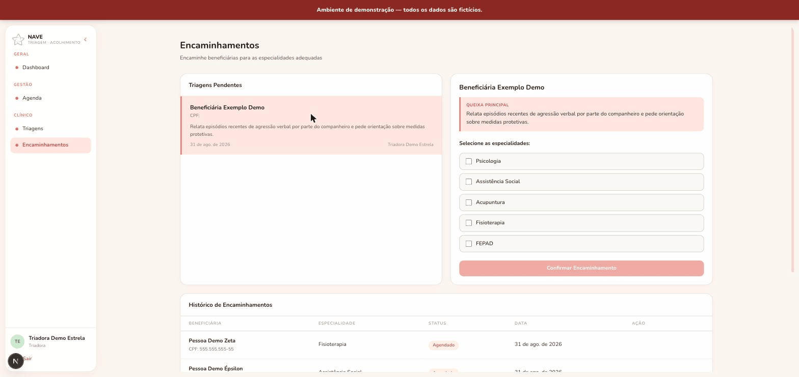

> O botão fica apagado enquanto você não marcar nenhuma especialidade. Se ele
> não estiver clicável, é isso.

Se aparecer um aviso dizendo que já existe encaminhamento para aquela
especialidade, é porque essa triagem já foi encaminhada para lá antes — não
precisa fazer de novo.

### Embaixo: o histórico de encaminhamentos

Mais abaixo na mesma tela fica a tabela **Histórico de Encaminhamentos**, com
tudo que já foi encaminhado: beneficiária, especialidade, situação e data.

A coluna de situação mostra em que pé está:

- **Pendente** — encaminhado, mas ainda sem atendimento marcado
- **Agendado** — já tem data e hora

É nessa tabela que você marca o atendimento. Vamos para lá.

---

## 6. Agendar o atendimento

Existem dois caminhos. O primeiro é o mais prático no dia a dia, porque já
deixa o atendimento ligado ao encaminhamento.

### Caminho 1 — agendando a partir do encaminhamento (recomendado)

1. Vá em **Encaminhamentos** e desça até a tabela
   **Histórico de Encaminhamentos**.
2. Ache a linha da beneficiária. Na última coluna, o botão **Agendar** aparece
   **só nas linhas com situação Pendente** — as que já foram agendadas não
   mostram o botão, porque já têm horário.
3. Clique em **Agendar**.

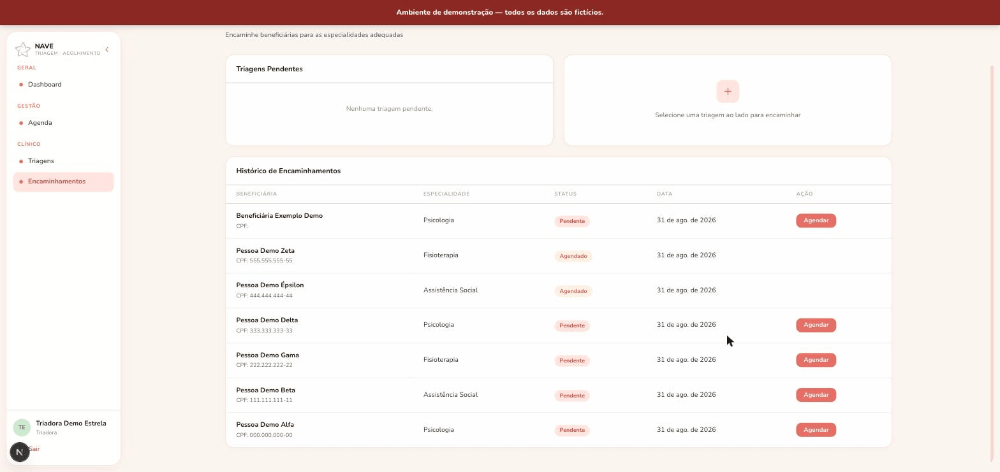

Abre a janela **Novo agendamento**, já com a beneficiária preenchida e uma
tarja roxa dizendo **"Vinculando encaminhamento — [especialidade]"**. É assim
que você sabe que o atendimento vai ficar ligado àquele encaminhamento.

4. Preencha:

| Campo | Observação |
|-------|------------|
| **Beneficiária** | Já vem preenchida e não pode ser trocada — é a do encaminhamento. |
| **Profissional** | Escolha na lista. Aparece o nome e a especialidade de cada uma. |
| **Data** e **Hora** | Obrigatórios. |
| Status | Começa em Agendado. |
| Observações | Opcional. Ex.: "primeira consulta", "preferência por manhã". |

5. Clique em **Salvar**.

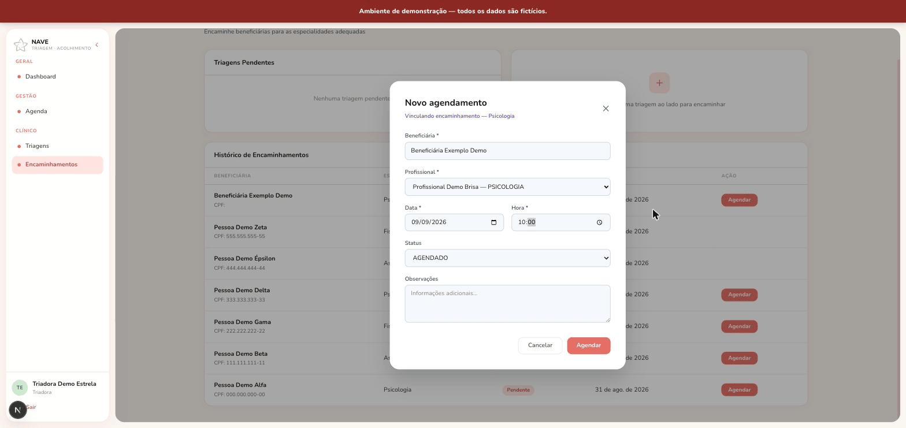

Pronto: o encaminhamento muda de **Pendente** para **Agendado** sozinho, e o
atendimento aparece na agenda da profissional.

### Caminho 2 — direto pela agenda

Para atendimentos de retorno ou que não vieram de um encaminhamento:

1. Menu **Agenda** → botão **Novo agendamento**.
2. Aqui a beneficiária **não** vem preenchida: digite o nome no campo de busca
   e clique nela na lista.
3. O resto é igual: profissional, data, hora, status e observações.

### Se o sistema avisar sobre conflito de horário

Uma mensagem dizendo que a profissional já tem atendimento nesse horário
significa que existe outro compromisso dela **a menos de 30 minutos** dali.

Isso é uma proteção, não um erro: evita marcar duas pessoas quase em cima uma
da outra. Escolha outro horário, ou outra profissional.

### Acompanhar e mudar o atendimento

Na **Agenda**, cada atendimento tem uma situação, com cor própria:

- **Agendado** — marcado
- **Confirmado** — a beneficiária confirmou que vem
- **Realizado** — aconteceu
- **Cancelado** — não vai acontecer

Para cancelar, abra o atendimento e clique em **Cancelar consulta**. O sistema
pede confirmação antes. O atendimento não some da agenda — fica registrado como
cancelado, que é o certo para o histórico.

Se você é **profissional**, edita os seus próprios atendimentos. Os das colegas
aparecem para você se organizar, mas não podem ser alterados.

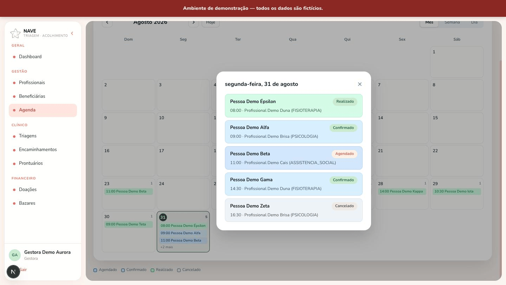

---

## 7. Arquivar uma beneficiária

Quando o acompanhamento termina de vez, você arquiva a ficha.

**Antes de mais nada, fique tranquila: arquivar não apaga nada.** O histórico
clínico — triagens, queixas, encaminhamentos e prontuários — continua todo lá,
inteiro, e você continua conseguindo consultar. A beneficiária só deixa de
aparecer na lista do dia a dia.

O sistema foi feito assim de propósito: histórico de acolhimento não se joga
fora.

### Como arquivar

1. Menu **Beneficiárias**.
2. Ache a pessoa (dá para buscar por nome ou CPF).
3. Clique no botão **Arquivar** na linha dela.
4. O sistema pergunta:

   > Arquivar "[nome]"? O histórico clínico é preservado e a beneficiária deixa
   > de aparecer na listagem.

5. Confirme clicando em **Arquivar**.

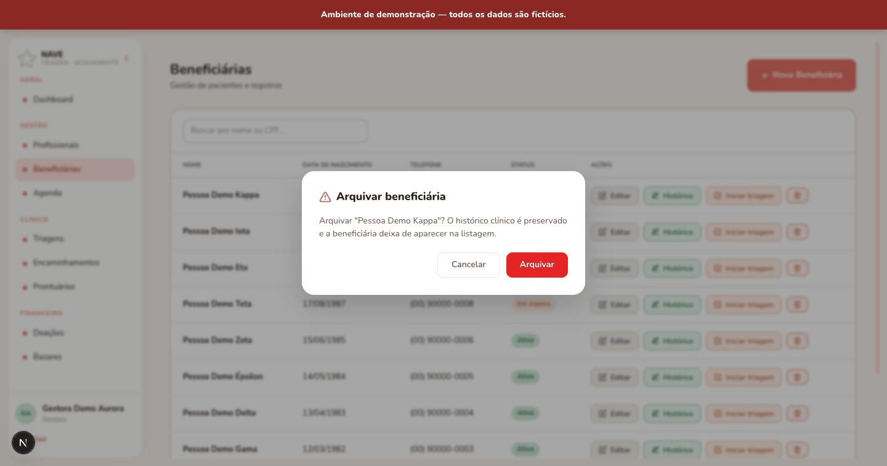

### Como ver o histórico de quem foi arquivada

Pela tela de **Histórico** da beneficiária, que continua acessível. Lá aparece
um aviso com a data em que ela foi arquivada, e logo abaixo as triagens e os
prontuários, como sempre.

### E se eu arquivar sem querer?

Não tem um botão de desarquivar na tela. Se acontecer, fale com a coordenação
ou com quem cuida do sistema — dá para reverter, e nenhum dado foi perdido.

Se a ideia é só marcar que o acompanhamento terminou, mas manter a pessoa à
vista na lista, prefira **editar a ficha e mudar o Status para Encerrada**. É
mais fácil de voltar atrás.

---

## 8. Problemas comuns

### "Não foi possível conectar ao servidor"

Essa mensagem quer dizer que o sistema não conseguiu falar com o computador
onde ficam guardados os dados. Vá testando nesta ordem:

**1. Confira sua internet.**
Abra outro site qualquer. Se nenhum abrir, o problema é a conexão do local, não
o sistema.

**2. Atualize a página.**
Aperte `F5`, ou `Ctrl+R` (no Windows) / `Cmd+R` (no Mac). Às vezes resolve na
hora.

**3. Espere uns minutos e tente de novo.**
Instabilidades passageiras acontecem.

**4. Pergunte a uma colega.**
Se estiver só com você, é o seu computador ou o seu navegador. Se estiver com
todo mundo, é o sistema — e aí é caso de avisar quem cuida dele.

### A tela fica carregando e não termina, ou nada abre

Quando **todas** as telas param de responder ao mesmo tempo — não é uma página
só, é o sistema inteiro — costuma ser um caso específico, e ele tem conserto:

**O sistema "adormeceu" por falta de uso.**

O serviço onde os dados ficam guardados é gratuito, e serviços gratuitos têm
uma regra: se ninguém usa por cerca de uma semana, eles entram em modo de
espera para poupar recursos. É parecido com o computador que hiberna sozinho
quando você sai para o almoço.

Acontece tipicamente depois de recesso, feriado longo ou férias coletivas.

**Seus dados estão todos lá.** Nada foi apagado, nada se perdeu. O sistema só
precisa ser "acordado", e isso leva de alguns minutos até uma meia hora.

**O que fazer:** avise quem cuida do sistema dizendo que ele **precisa ser
reativado**. É um procedimento rápido, mas só pode ser feito por quem tem a
senha de administração — não tem nada que você possa clicar daí para resolver.

Para evitar que aconteça de novo: se alguém entrar no sistema pelo menos uma
vez por semana, ele não adormece. Em época de recesso, combinem quem faz essa
visitinha.

### Entrei, mas o menu está com menos opções do que antes

Provavelmente o seu perfil mudou. Confira o seu nome no rodapé do menu — o
perfil aparece logo abaixo. Se não for o que você esperava, fale com a
coordenação.

### Cliquei em algo e o sistema me jogou de volta para a tela inicial

Você tentou abrir uma parte que não faz parte do seu perfil. Não é erro nem
travamento — é o sistema protegendo o acesso. A [seção 1](#1-o-que-cada-perfil-pode-fazer)
mostra o que cada perfil abre.

### O sistema diz que o CPF já existe

Já tem alguém cadastrada com esse CPF. Antes de cadastrar de novo, busque pelo
CPF na lista de beneficiárias — em geral é a mesma pessoa, cadastrada por outra
colega ou em outro momento.

Se for mesmo uma pessoa diferente, confira se não houve erro de digitação. Na
dúvida, o CPF pode ficar em branco e ser preenchido depois.

### Não acho uma beneficiária que eu sei que cadastrei

Duas possibilidades:

1. **Ela foi arquivada.** Beneficiárias arquivadas somem da lista de propósito.
2. **A busca é por nome ou CPF.** Tente escrever só o primeiro nome, ou parte
   dele — a busca não diferencia maiúsculas de minúsculas, mas precisa que os
   pedaços do nome batam.

### A data aparece com um dia a menos

Se você vir isso em algum lugar, avise quem cuida do sistema. Já foi corrigido
uma vez, e se voltou a aparecer é caso de olhar de novo.

### Não sei o que fazer e não está aqui

Fale com a coordenação. E se for algo que outras colegas também vão precisar
saber, peça para incluírem neste manual — ele existe para isso.

---

*Este manual acompanha o sistema. Se alguma tela mudar e o manual ficar
desatualizado, avise para corrigirmos.*
