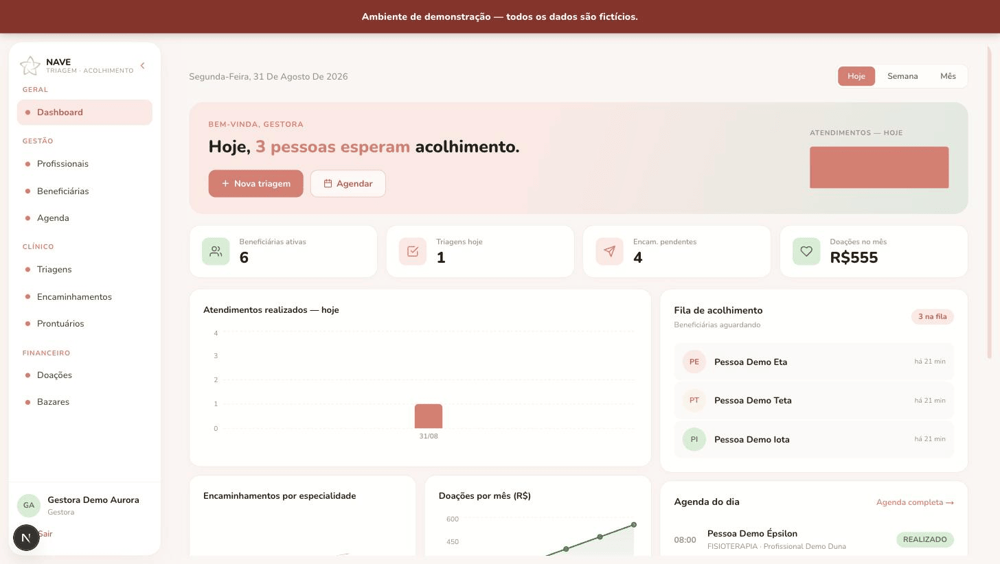
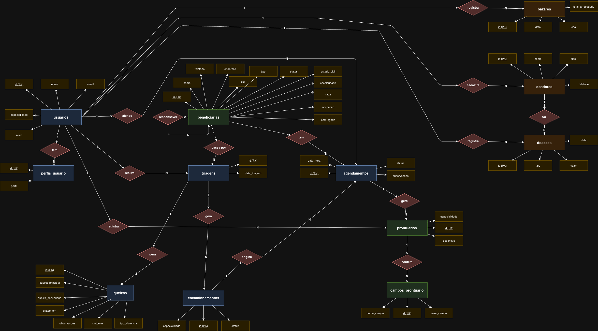
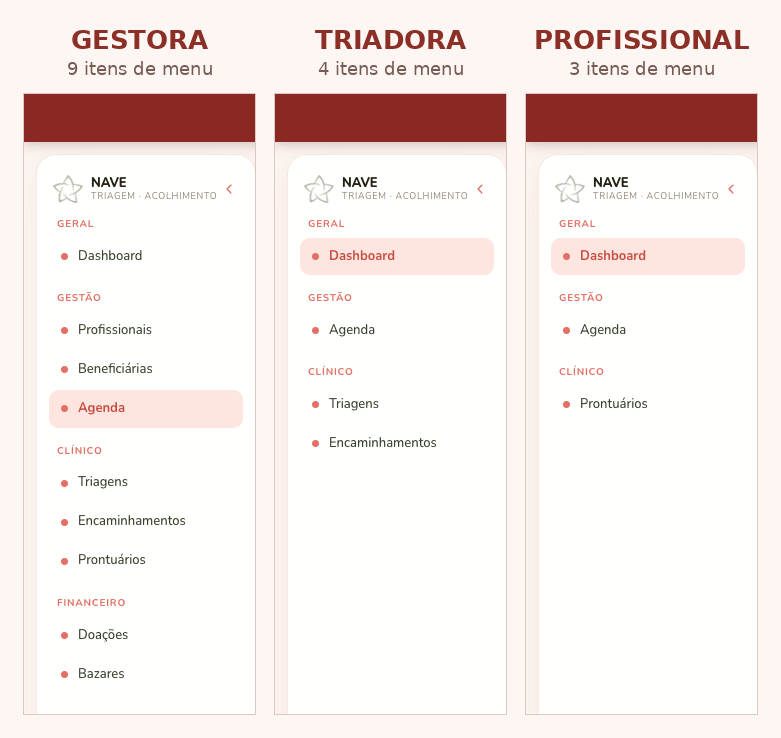
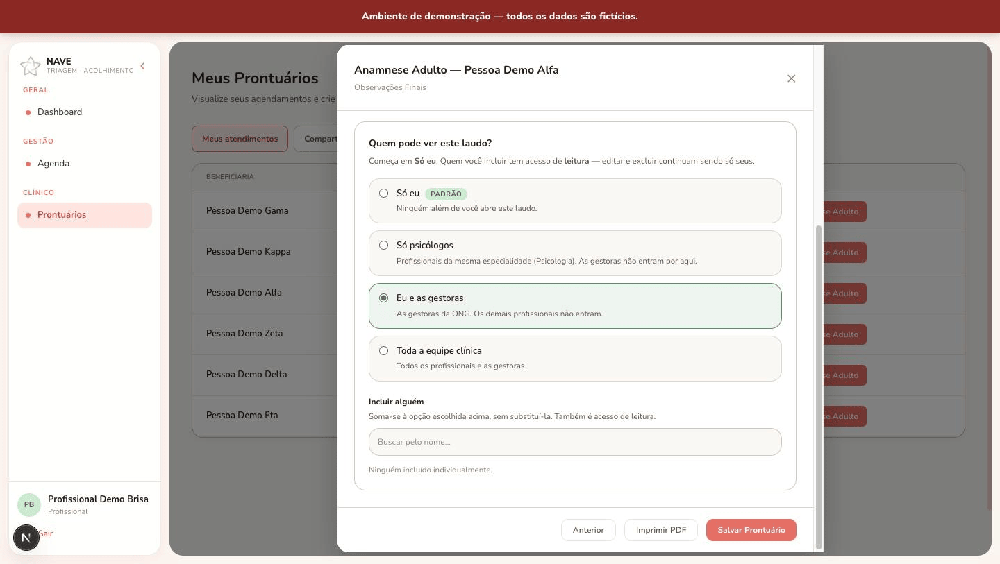

# Sistema NAVE

> **Repositório de portfólio publicado com autorização da organização cliente.** Esta versão contém exclusivamente dados de demonstração fictícios e não inclui dados reais de pessoas atendidas, profissionais, doadores ou terceiros.

O Sistema NAVE centraliza a gestão interna de uma organização do terceiro setor que operava seus processos em papel e WhatsApp. A aplicação reúne cadastros, triagens, encaminhamentos, agendas, prontuários com acesso controlado, doações, bazares e painéis operacionais em um único fluxo autenticado.

## Visão rápida

~~~text
Next.js (frontend) --HTTP/JSON--> NestJS (API) --Prisma--> PostgreSQL
          |                           |
          +---- sessão JWT/RBAC ------+
~~~

| Camada | Tecnologia |
| --- | --- |
| Frontend | Next.js 16, React 19, TypeScript, Tailwind CSS 4 e Recharts |
| Backend | NestJS 11, TypeScript, Passport e JWT |
| Dados | PostgreSQL, Prisma ORM e adapter pg |
| Validação e testes | class-validator, Jest e Supertest |

O frontend consome uma API REST. O backend concentra autenticação, autorização e regras de negócio; o Prisma mapeia o domínio e persiste os dados no PostgreSQL.

## Domínio e modelo de dados

O fluxo principal conecta beneficiárias a triagens e queixas, gera encaminhamentos por especialidade, organiza agendamentos com profissionais e permite registrar prontuários. Os módulos administrativos cobrem usuários e perfis, doadores, doações, campanhas e bazares.

O [modelo lógico completo](docs/README.md) documenta tabelas, atributos e relações com maior detalhe.

O fluxo pode ser acompanhado na própria interface, do encaminhamento por especialidade até a agenda com os quatro status de atendimento:

## Controle de acesso aos prontuários

O sistema possui três perfis funcionais:

- **GESTORA:** administra usuários e processos organizacionais e acessa as áreas de gestão.
- **TRIADORA:** registra triagens, queixas e encaminhamentos.
- **PROFISSIONAL:** acompanha a própria agenda e registra prontuários vinculados à sua especialidade.

O RBAC não existe só no backend: cada perfil também enxerga um menu diferente na interface.

Cada prontuário possui um dos quatro níveis de visibilidade:

| Visibilidade | Quem pode acessar o conteúdo |
| --- | --- |
| **PRIVADO** | Apenas a pessoa autora, salvo compartilhamento explícito. |
| **ESPECIALIDADE** | Profissionais cuja especialidade seja igual à do prontuário. |
| **GESTORAS** | Usuários com perfil GESTORA. |
| **EQUIPE_CLINICA** | Usuários com perfil GESTORA ou PROFISSIONAL. |

Esse controle é configurável por prontuário, diretamente na tela de preenchimento:

A autoria e o compartilhamento nominal concedem acesso independentemente do nível. Quando a regra não autoriza o conteúdo, a API devolve somente metadados do registro e marca o conteúdo como restrito.

### Por que cruzar perfil e especialidade?

Perfil e especialidade respondem a perguntas diferentes. O perfil representa a função organizacional e define quais operações o usuário pode executar; a especialidade representa o contexto técnico em que um profissional atua. Autorizar apenas pelo perfil PROFISSIONAL abriria todos os registros clínicos para toda a equipe. Autorizar apenas pela especialidade não cobriria responsabilidades legítimas de gestão.

A combinação permite aplicar menor privilégio sem bloquear o trabalho: registros ESPECIALIDADE circulam somente entre pares da mesma área, registros GESTORAS atendem ao fluxo administrativo e EQUIPE_CLINICA suporta colaboração multiprofissional. Casos excepcionais são tratados por compartilhamento explícito, sem ampliar permanentemente o acesso de um perfil inteiro.

## Como rodar localmente

### Pré-requisitos

- Node.js 20 ou superior
- npm
- Docker com Docker Compose

### 1. Banco local

~~~bash
docker compose up -d
~~~

O Compose inicia um PostgreSQL exclusivamente local, exposto na porta 5433 (para não conflitar com um PostgreSQL já instalado localmente na 5432 padrão).

### 2. Backend

~~~bash
cd backend
cp .env.example .env
openssl rand -hex 32
~~~

Copie a saída do último comando para JWT_SECRET em backend/.env. Depois:

~~~bash
npm install
npx prisma db push
npm run seed
npm run start:dev
~~~

A API estará em [http://localhost:3001](http://localhost:3001).

### 3. Frontend

Em outro terminal:

~~~bash
cd frontend
cp .env.example .env.local
npm install
npm run dev
~~~

A aplicação estará em [http://localhost:3000](http://localhost:3000).

## Credenciais de demonstração

Todos os usuários abaixo usam a senha **NaveDemo@2026**. Ela é pública e existe somente para a instalação local de demonstração.

| Perfil | E-mail |
| --- | --- |
| GESTORA | gestora.demo@example.com |
| PROFISSIONAL (Psicologia) | profissional.psi.demo@example.com |
| TRIADORA | triadora.demo@example.com |

O seed também cria profissionais fictícios de Assistência Social e Fisioterapia para popular agenda, encaminhamentos e regras por especialidade.

## Documentação

- [Documentação técnica](DOCUMENTACAO_TECNICA.md)
- [Manual do usuário](MANUAL_USUARIO.md)
- [DER](docs/der.png)
- [Modelo lógico](docs/README.md)
- [Casos de uso](docs/casos-de-uso.png)
- [Requisitos](docs/requisitos.md)

O DER, o modelo lógico, os diagramas de caso de uso e o documento de requisitos foram produzidos por mim durante a engenharia do sistema.
